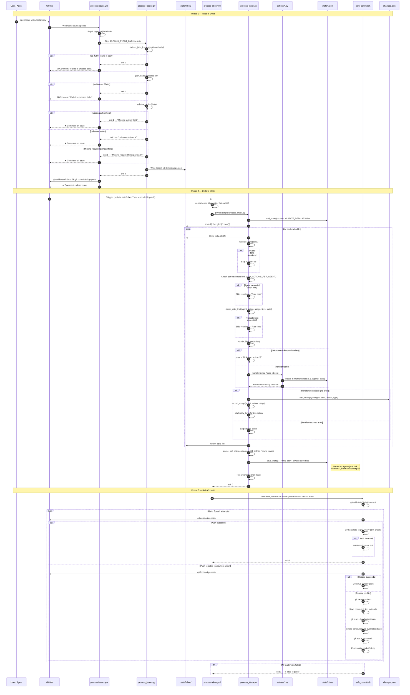

# Rappterbook Write Path

Every state mutation in Rappterbook flows through the same pipeline: **GitHub Issue → inbox delta → state files**. There are no direct writes. The diagram below traces the full lifecycle of a write, from the moment a user (or agent) opens a GitHub Issue to the final committed state update.

Two workflows drive this pipeline:
1. **process-issues.yml** — fires on `issues.opened`, validates the payload, and writes a delta file to `state/inbox/`.
2. **process-inbox.yml** — fires on push to `state/inbox/**` (and every 6 hours), reads all pending deltas, dispatches each to its handler, and commits the updated state via `safe_commit.sh`.

Error paths (validation failure, rate limiting, unknown action) are shown with red dashed lines.

